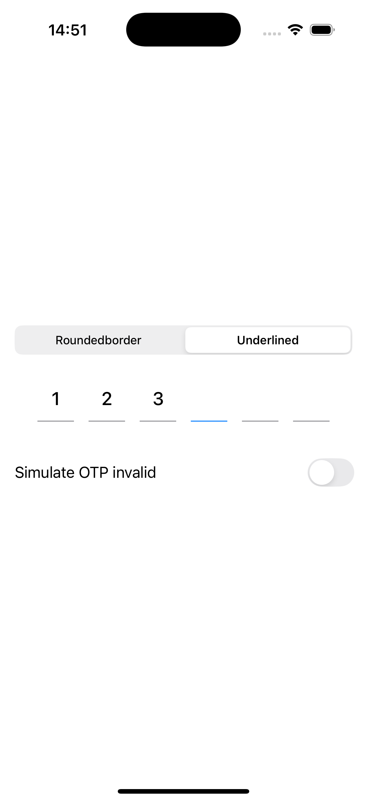
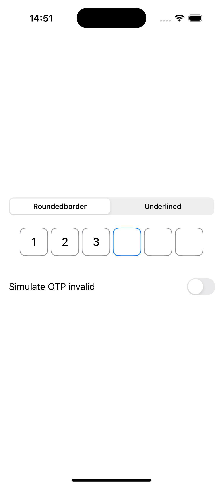

# OTPTextField for SwiftUI 🔐

A customizable, animated One-Time Password (OTP) input component for SwiftUI that supports rounded borders, underlines, shake animation (invalid otp), blur text replacement (iOS 17+), and more..  

Easily handle 2FA/OTP flows with flexible visual styles and a developer-friendly API.

## ✨ Features

- [x] Underlined and Rounded Border styles
- [x] Animates on invalid OTP input
- [x] Fully customizable (font, spacing, border, colors)
- [x] `@Binding` support for OTP text and state
- [x] Focus and typing state handling out of the box

---

## 📦 Installation

You can use Swift Package Manager:

```swift
.package(url: "https://github.com/huyparody/OTPTextField.git", from: "1.0.0")
```

## ⚠️ Notes
•	The shake animation and blur text replacement are only available on iOS 17+

•	The rest of the features are compatible with iOS 15+

•	Built with SwiftUI


## 🚀 Basic Usage

```swift
struct ContentView: View {
    
    @State private var text = ""
    @State private var typingState: TypingState = .typing

    var body: some View {
        OTPTextField(
            otpMaxDigit: 6,
            style: .underlined,
            text: $text,
            typingState: $typingState,
            onComplete: {
                print("OTP input complete: \(text)")
            }
        )
        .padding()
    }
}
```
## 🎨 Available Styles
### ✅ Underlined Style

```swift
style(.underlined)
```
Visually shows a line under each digit box.



---

### 🟦 Rounded Border Style

```swift
style(.roundedBorder)
```

Each digit is inside a rounded rectangle.



## ⚙️ Customization


Use `OTPTextFieldOptions` to customize colors, font, spacing, and sizing:

| Property               | Type       | Default Value                          | Description                                                                 |
|------------------------|------------|----------------------------------------|-----------------------------------------------------------------------------|
| `borderColor`          | `Color`    | `.gray`                                | The border color in the normal state.                                       |
| `borderCornerRadius`   | `CGFloat`  | `10`                                   | Corner radius for rounded border style.                                     |
| `borderWidth`          | `CGFloat`  | `1.2`                                  | Border thickness.                                                           |
| `fillColor`            | `Color`    | `.clear`                               | Background fill color for each OTP field (used with `.roundedBorder`).     |
| `underlineHeight`      | `CGFloat`  | `1`                                    | Height of the underline (used with `.underlined`).                          |
| `activeBorderColor`    | `Color`    | `.blue`                                | Border color when the field is focused.                                     |
| `invalidColor`         | `Color`    | `.red`                                 | Border color used when the input is invalid.                                |
| `textFieldHeight`      | `CGFloat`  | `50`                                   | Height of each OTP field box.                                               |
| `textFont`             | `Font`     | `.system(size: 20, weight: .medium)`   | Font used for OTP characters.                                               |
| `textColor`            | `Color`    | `.primary`                             | Text color for OTP input.                                                   |
| `underlineSpacing`     | `CGFloat`  | `16`                                   | Spacing between underline segments (used with `.underlined`).               |
| `roundedCornerSpacing` | `CGFloat`  | `6`                                    | Spacing between boxes (used with `.roundedBorder`).                         |

## ❗ Handling Invalid OTP (requires iOS 17+)

Trigger a visual "shake" or invalid animation when OTP is incorrect:

```swift
typingState = .invalid
```

To reset:

```swift
typingState = .typing
```


https://github.com/user-attachments/assets/cda317d5-34b8-45bb-9d85-242e87a7f903


## 🧠 TypingState Enum

```swift
enum TypingState {
    case typing
    case invalid
}
```

## 📋 Advanced Example

```swift
struct ContentView: View {
    
    @State private var text = ""
    @State private var typingState: TypingState = .typing
    @State private var selectedStyle: OTPTextFieldStyle = .underlined
    @State private var simulateInvalidOTP = false
    
    let options = OTPTextFieldOptions(borderColor: .red,
                                      activeBorderColor: .green,
                                      textFont: .system(size: 24, weight: .bold),
                                      textColor: .gray)
    
    var body: some View {
        VStack(spacing: 24) {
            Picker("Style", selection: $selectedStyle) {
                ForEach(OTPTextFieldStyle.allCases) { style in
                    Text(style.rawValue.capitalized).tag(style)
                }
            }
            .pickerStyle(.segmented)
            .padding(.horizontal)
            
            OTPTextField(
                otpMaxDigit: 6,
                style: selectedStyle,
                options: options,
                text: $text,
                typingState: $typingState,
                onComplete: {
                    print("Trigger validate otp")
                }
            )
            .padding(.horizontal)
            
            Toggle("Simulate OTP invalid", isOn: $simulateInvalidOTP)
                .padding()
                .onChange(of: simulateInvalidOTP) { isOn in
                    if isOn {
                        text = (0..<6).map { _ in "\(Int.random(in: 0...9))" }.joined()
                        typingState = .invalid
                    } else {
                        text = ""
                        typingState = .typing
                    }
                }
        }
        .padding(.vertical)
    }
}
```

## 📄 License
OTPTextField is released under an MIT license.

